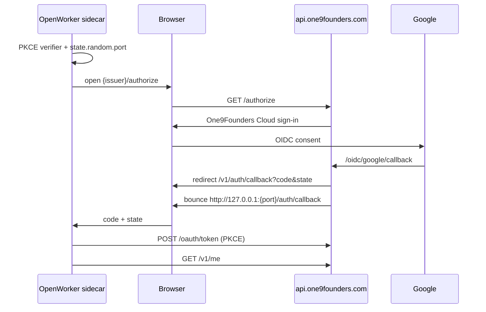
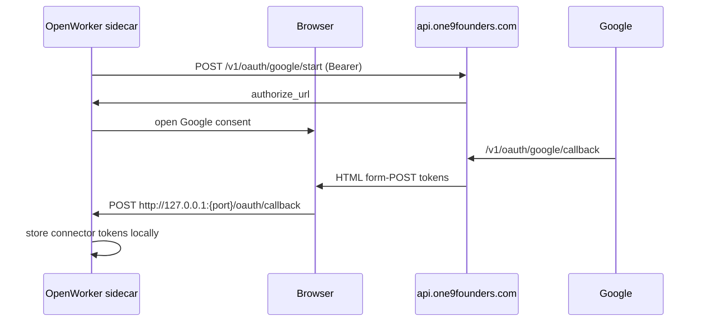

# OpenWorker × One9Founders Cloud — Integration

Local-first desktop agent + One9-hosted identity/OAuth broker.

**Success definition:** A founder lands on [one9founders.com/openworker](https://one9founders.com/openworker), downloads OpenWorker, signs in with Google through **One9Founders Cloud**, and works locally — identity/OAuth on One9, work data on device.

Related: [`COWORKER_CLOUD.md`](./COWORKER_CLOUD.md) (broker endpoints & env).

---

## Architecture (Phase 0)

### User journey

```
one9founders.com/openworker
        → Download / install OpenWorker
        → Open desktop app
        → Sign in (PKCE → One9Founders Cloud Google page)
        → Add model key (local)
        → Connect Gmail (one-click or manual)
        → First task (local agent)
```

### Account login sequence



### Gmail one-click sequence



### Data residency

| Data | Where |
|------|--------|
| Chats, files, tool args, agent runs | Desktop only |
| Model API keys | Desktop secret store |
| One9 user identity (email, id) | One9 DB |
| Managed connector refresh material | One9 DB (for `/refresh`) + copy on desktop |
| Chat transcripts | **Never** uploaded to One9 |
| Telemetry events | Ack-only; no content storage; opt-out in app |

### Threat model (MVP controls)

- PKCE S256 required; one-time auth codes; short TTL
- `redirect_uri` allowlisted to `{PUBLIC}/v1/auth/callback` only
- Managed OAuth sidecar redirect must be `http://127.0.0.1:{port}/oauth/callback`
- Login bounce always to `127.0.0.1` (port from state, bounded 1–65535)
- Audience must match `COWORKER_CLOUD_AUDIENCE` when provided
- Admin UI hides raw access/refresh tokens
- Manual connector paste works signed out

### Gaps vs stock OpenWorker Cloud

| Feature | MVP status |
|---------|------------|
| Account Google sign-in | ✅ |
| Gmail / Calendar / Drive one-click | ✅ (One9 Google project) |
| Slack / GitHub / Notion / HubSpot managed | ⏳ stubs (501) |
| Slack/GitHub inbound relay WS | ❌ out of scope |
| Persona gallery | ❌ not on One9 broker |
| One9-hosted LLMs | ❌ out of scope |

---

## Env vars (backend)

```bash
GOOGLE_CLIENT_ID=...
GOOGLE_CLIENT_SECRET=...
COWORKER_CLOUD_CLIENT_ID=one9founders-openworker-dev   # public PKCE client id
COWORKER_CLOUD_PUBLIC_URL=https://api.one9founders.com # or http://127.0.0.1:8000
COWORKER_CLOUD_AUDIENCE=https://api.one9founders.com
```

Local defaults are already in `.env.example`.

---

## Google Cloud Console

OAuth client type: **Web application**.

Authorized redirect URIs:

1. `{COWORKER_CLOUD_PUBLIC_URL}/oidc/google/callback` — account sign-in  
2. `{COWORKER_CLOUD_PUBLIC_URL}/v1/oauth/google/callback` — managed connectors  

Examples:

- Local: `http://127.0.0.1:8000/oidc/google/callback`, `http://127.0.0.1:8000/v1/oauth/google/callback`
- Prod: `https://api.one9founders.com/oidc/google/callback`, `https://api.one9founders.com/v1/oauth/google/callback`

Enable Google APIs as needed for scopes: Gmail, Calendar, Drive (readonly).

---

## Point OpenWorker at One9

`~/.config/coworker/config.toml`:

**Local**

```toml
cloud_base_url = "http://127.0.0.1:8000"
cloud_auth_domain = "127.0.0.1:8000"
cloud_client_id = "one9founders-openworker-dev"
cloud_audience = "http://127.0.0.1:8000"
cloud_display_name = "One9Founders Cloud"
cloud_relay_ws_url = ""
```

**Production**

```toml
cloud_base_url = "https://api.one9founders.com"
cloud_auth_domain = "api.one9founders.com"
cloud_client_id = "<prod COWORKER_CLOUD_CLIENT_ID>"
cloud_audience = "https://api.one9founders.com"
cloud_display_name = "One9Founders Cloud"
cloud_relay_ws_url = ""
```

Restart `openworker-server` after edits. UI should say **One9Founders Cloud**.

---

## Migrate + run (local)

```bash
cd backend
python manage.py migrate coworker_cloud
python manage.py runserver 8000
# http://127.0.0.1:8000/cloud/
```

```bash
cd openworker
# with config.toml pointed at 127.0.0.1:8000
openworker-server   # or your usual launch
```

```bash
cd frontend
npm run dev
# http://localhost:3000/openworker
```

---

## Prod launch checklist

- [ ] `python manage.py migrate coworker_cloud` on production DB
- [ ] Set `COWORKER_CLOUD_*` + `GOOGLE_*` on API host
- [ ] Register both Google redirect URIs for `https://api.one9founders.com`
- [ ] Confirm CSRF trusted origins include `https://api.one9founders.com`
- [ ] Deploy frontend `/openworker` page
- [ ] Ship or document One9 `config.toml` / branded build defaults
- [ ] Smoke: sign-in → `/v1/me` email in app → Gmail one-click or manual
- [ ] Admin: user + optional `CloudConnection`; **no** chat rows in One9
- [ ] Monitor `/oauth/token` and `/v1/oauth/google/*` error rates
- [ ] Rate-limit `/authorize` and `/oauth/token` at the edge if not already

---

## 10-step manual QA

1. Open `https://one9founders.com/openworker` (or local `/openworker`).
2. Confirm privacy copy: local vs One9 responsibilities.
3. Download or install OpenWorker; configure One9 cloud keys if using stock build.
4. Launch app → Account → Sign in.
5. Browser shows **One9Founders Cloud** (not Auth0 OpenWorker tenant).
6. Complete Google; browser says signed in; app shows your email.
7. Connect Gmail via one-click **or** Manual paste while signed out (separate check).
8. Add a model key; run a trivial local task (“summarize this folder”).
9. In Django admin: user exists; optional `CloudConnection` for Gmail; no chat transcript tables populated by this flow.
10. Sign out in app; confirm one-click requires sign-in again; Manual still works.

---

## Demo script (click path)

1. “Here’s OpenWorker on One9Founders — local AI coworker.”  
2. Download CTA → install → open app.  
3. Sign in → Google on One9Founders Cloud.  
4. Show email in account menu.  
5. Connect Gmail one-click; open a mailbox task.  
6. Close with: “Prompts and keys never hit One9 — only identity and OAuth.”
